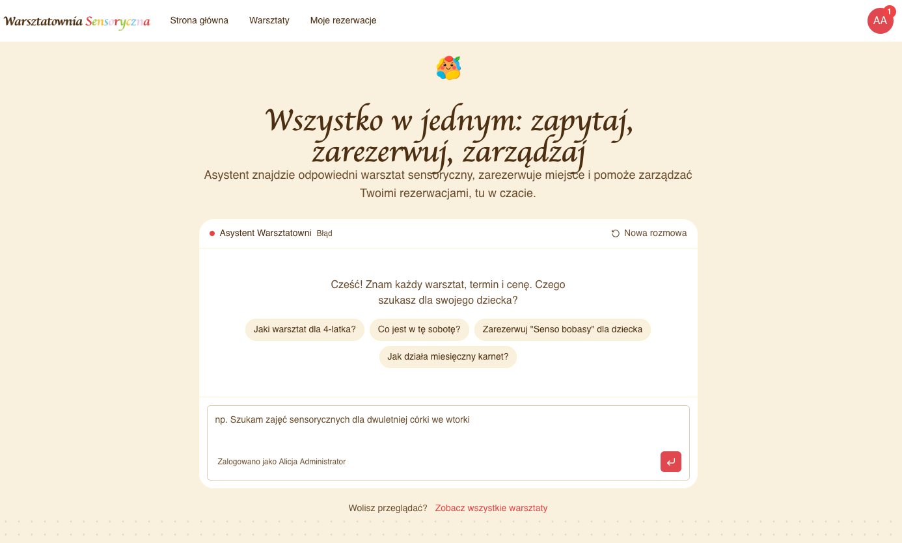
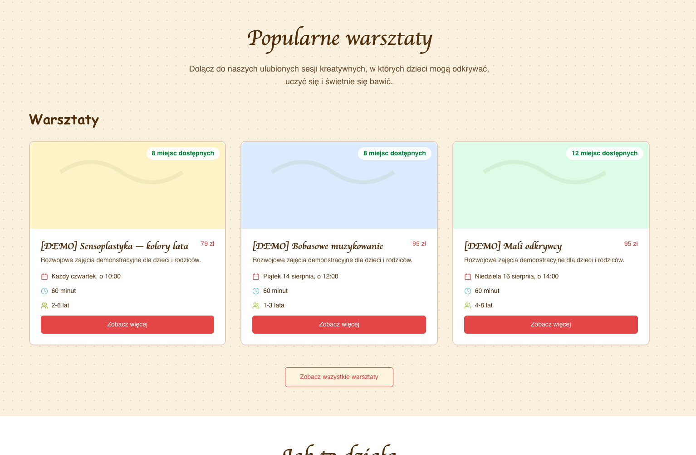
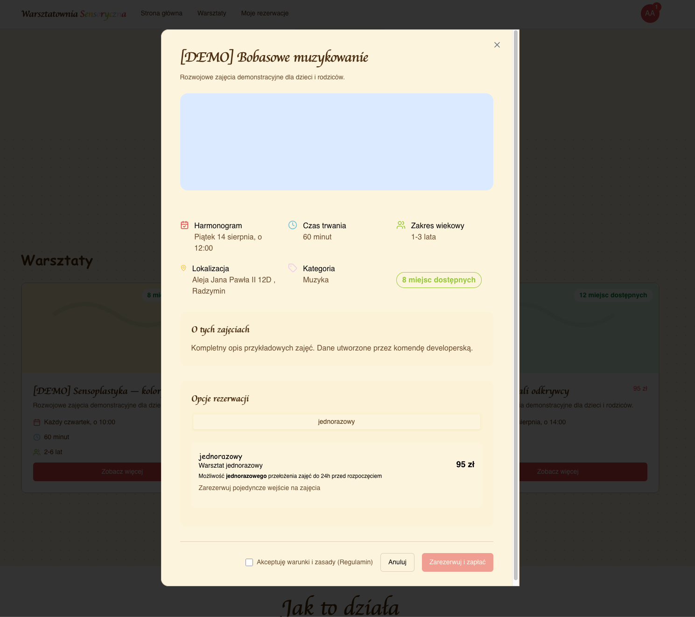
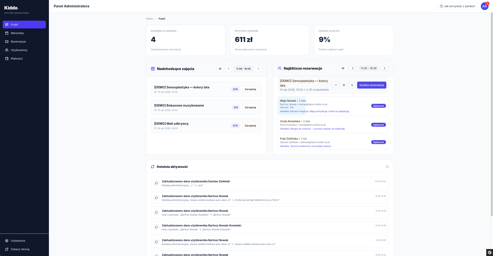
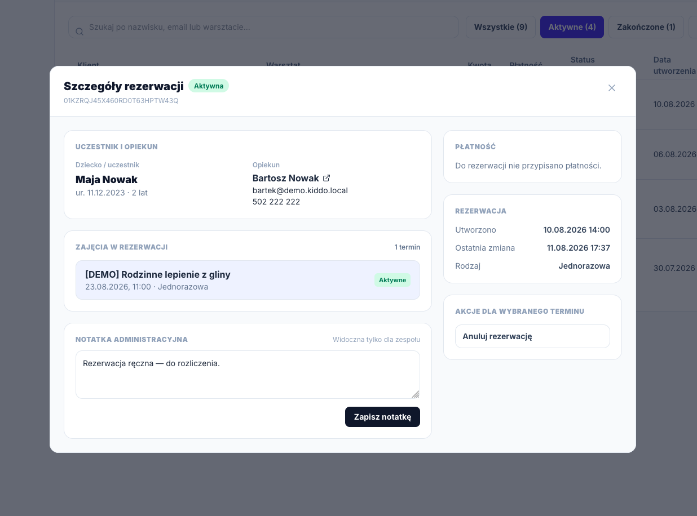

# Kiddo


Kiddo is a bilingual workshop-booking platform for families and a day-to-day operations system for workshop teams. It combines a public catalog, customer self-service, an administration CRM, payment reconciliation, notifications, and an optional conversational assistant.



## What the application does

### Public website and discovery

- Polish and English storefronts with localized routes and content.
- Searchable workshop catalog with dates, recurring series, prices, age ranges, duration, capacity, and remaining places.
- Workshop detail and booking flow for one-time tickets and four-entry carnets.
- Account registration, email confirmation, and passwordless login links.
- Newsletter subscription through Brevo, protected by a honeypot and rate limiting.
- Public `llm.txt`, health (`/health`) and ping (`/ping`) endpoints.




### Parent account

- Manage profile details and children.
- Review active, past, cancelled, and awaiting-approval reservations.
- Track payments and carnet usage.
- Cancel or reschedule eligible lessons according to the ticket policy.
- Request a refund and follow its status.
- Receive in-app and email notifications.

### Administration and instructors

- Role-based access for parents, instructors, administrators, and capability-specific admin areas.
- KPI dashboard for monthly bookings, paid revenue, and average occupancy.
- Weekly lesson schedule, recurring series, one-time workshops, capacity controls, instructors, ticket options, and lesson cancellation/reactivation.
- Reservation CRM with search, status filters, manual and quick booking, approval, cancellation, rescheduling, refund actions, notes, and attendee lists.
- Customer CRM with contact data, children, booking/payment history, internal notes, and user impersonation for support.
- Payment register with payment-state workflow and transfer-to-payment assignment.
- Automatic bank-transfer import from an IMAP mailbox and matching by payment code.
- Platform billing widget and configurable finance contact details.
- In-app notification tray and a searchable activity audit log.
- Guided admin tour and responsive desktop/mobile navigation.
- Feature flags for optional or staged capabilities.





### Automation and integrations

- Symfony Scheduler jobs expire unpaid bookings, import and match transfers, extend recurring schedules, and send daily customer/admin/instructor reminders.
- Symfony Messenger handles booking cancellation, rescheduling, refunds, notifications, and background work.
- Booking and payment state machines enforce valid lifecycle transitions.
- Optional ElevenLabs conversational assistant can discover workshops and, for authenticated users, manage profiles, children, bookings, payments, carnets, cancellations, and rescheduling.
- The assistant exposes authenticated user/admin tools through MCP (`/api/mcp`) and HTTP tool endpoints (`/api/v1/tools`).
- Sentry and structured logging provide production observability.

## Technology

- PHP 8.5, Symfony 8, Twig, Symfony UX Live Components, Turbo, Stimulus, and Tailwind CSS
- PostgreSQL 16 with Doctrine ORM and migrations
- Swoole application server
- Symfony Messenger, Scheduler, Workflow, Mailer, and MCP Bundle
- Docker Compose for local development

## Local development

### Requirements

- Docker with Docker Compose
- Composer credentials/access for the private VCS dependencies listed in `composer.json`

All PHP and Composer commands are run from the project root inside the `php` container:

```bash
docker compose run --rm php <command>
```

### First run

```bash
docker compose run --rm php composer install
docker compose up -d db
docker compose run --rm php bin/console doctrine:migrations:migrate --no-interaction
docker compose run --rm php bin/console tailwind:build
docker compose up -d
```

Open:

- Application: <http://localhost:9501>
- Mailpit: <http://localhost:8025>
- Admin panel: <http://localhost:9501/admin>

The application and database use the values from `.env` and any local overrides in `.env.local`. External integrations such as Brevo, IMAP, ElevenLabs, Telegram, and Sentry are optional for basic local browsing, but their environment variables are required to exercise those integrations.

## Demo data

Create a comprehensive, repeatable preview dataset:

```bash
docker compose up -d db
docker compose run --rm php bin/console doctrine:migrations:migrate --no-interaction
docker compose run --rm php bin/console app:dev:seed-demo --replace
```

The command creates representative users, children, lessons, recurring and one-time series, bookings, payments, transfers, cancellations, and reschedules. It never removes non-demo records.

Demo accounts use passwordless login:

| Role | Email |
| --- | --- |
| Administrator | `admin@demo.kiddo.local` |
| Instructor | `host@demo.kiddo.local` |
| Parent | `anna@demo.kiddo.local` |

Open `/login`, enter an address above, then use the link captured by Mailpit at <http://localhost:8025>.

To remove only the demo dataset:

```bash
docker compose run --rm php bin/console app:dev:seed-demo --purge
```

## Tests and code quality

Start PostgreSQL before any database-backed tests:

```bash
docker compose up -d db
```

| Goal | Command |
| --- | --- |
| All tests | `docker compose run --rm php composer tests` |
| Unit tests | `docker compose run --rm php bin/phpunit --group unit` |
| Unit and functional tests with coverage | `docker compose run --rm -e XDEBUG_MODE=coverage php sh -lc 'composer tests:functional:setup && bin/phpunit --group unit --group functional --coverage-html target/coverage/html'` |
| Smoke tests | `docker compose run --rm php composer tests:smoke` |
| Functional tests | `docker compose run --rm php composer tests:functional` |
| Filtered test | `docker compose run --rm php bin/phpunit --filter ClassNameOrMethod` |
| Apply automated fixes | `docker compose run --rm php composer qa:fix` |
| Full quality gate | `docker compose run --rm php composer qa` |

After code changes, run `composer qa:fix`, review its diff, then run `composer qa`.

Pull requests must cover at least 50% of the executable lines they add or change. CI measures both unit and functional tests, publishes the complete report as the `test-coverage` artifact, and displays its totals in the workflow summary.

## Useful commands

```bash
# Inspect routes
docker compose run --rm php bin/console debug:router

# Rebuild Tailwind during development
docker compose run --rm php bin/console tailwind:build --watch

# Update stored lesson maps after model changes
docker compose run --rm php bin/console app:booking:update-lesson-maps
```

## Project structure

```text
assets/          Stimulus controllers, styles, and browser assets
config/          Symfony services, routes, workflows, and package configuration
docs/            Integration and assistant documentation
migrations/      Doctrine database migrations
src/Application Business use cases, commands, workflows, and chat tools
src/Entity       Domain entities, value objects, and DTOs
src/Infrastructure External services, persistence, messaging, scheduling, and MCP
src/UserInterface HTTP actions and Symfony UX Live Components
templates/       Public, account, admin, component, and email templates
tests/           Unit, smoke, functional, repository, and domain tests
```

## License

Proprietary. See `composer.json` for package metadata.
